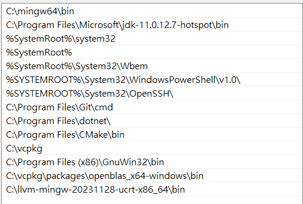

# 2024 I2P Mini Project 2 - Tower Defense

## Features

## Contribution

| **Features**                              | **張立璿**  | **郭明懿** | **陳廷森** |
| :---------------------------------------- | :-------:  | :-------: | :-------: |
| Potion Class: `Frozen Spell`              |     -      |     -     |    100%   |
| Potion Class: `Shield Spell`              |     -      |     -     |    100%   |
| Potion Class: `Berserk Spell`             |     -      |     -     |    100%   |
| Landmine Class: `Explode Landmine`        |     -      |     -     |    100%   |
| New UI: `Hover Image Button`              |    70%     |     -     |    30%    |
| New Game Mode: `Survival Play Mode`       |    80%     |     -     |    20%    |
| New Game Mode: `Reverse Play Mode`        |    70%     |     -     |    30%    |
| New Game Feature: `Dark Mode`             |   100%     |     -     |      -    |
| New Game Feature: `Better Turret Aiming`  |   100%     |     -     |      -    |
| New Game Feature: `Difficulty Selection`  |    80%     |   20%     |      -    |
| New Enemy: `To Do`                        |     -      |     -     |      -    |
| New Turret: `To Do`                       |     -      |     -     |      -    |
| New Scene: `Map Create Scene`             |   100%     |     -     |      -    |
| New Scene: `Revive Scene`                 |    70%     |   15%     |    15%    |
| New Scene: `Data Generating Scene`        |   100%     |     -     |      -    |
| Stage Select: `AI Digit Classification`   |   100%     |     -     |      -    |

## Appendix: How to install mlpack
* tested under the following environment
    * windows
    * compiler: llvm-mingw-20231128-urct-x86_64
    * vscode
* 安裝 [vcpkg](https://learn.microsoft.com/zh-tw/vcpkg/get_started/get-started?pivots=shell-cmd)
* 將 `vcpkg` 放到環境變數 (整個資料夾)
* command line 輸入： `vcpkg install openblas`
* `vcpkg/packages` 下會有 `openblas_x64-windows`，將其中的 `bin` 資料夾放到環境變數

